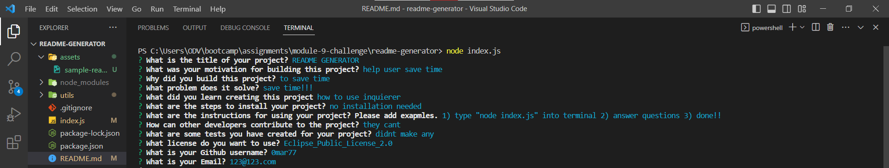
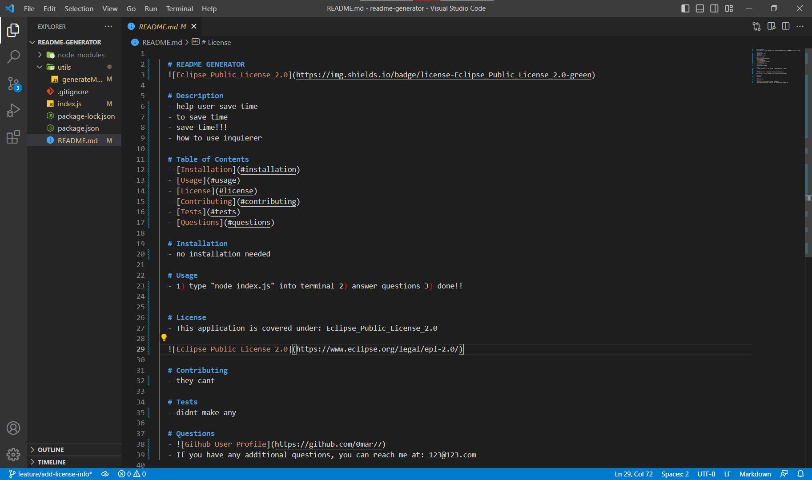

# README Generator

# Description

- The motivation behind this project was to help the user focus on his project and not the README file
- I built this project to help the user focus on his project
- This project will help the user save time 
- Creating this project helped me learn how to use inquierer

# Usage
- To initaite the app, type "node index.js" into the termnial 
- Answer the questions and done!!

- Path to sample README: assets/README.md

Link to walkthrough video:[https://drive.google.com/file/d/1s9ytzyxpc7ak7OW-_iZM1EeKVxocsbtF/view?usp=sharing]

